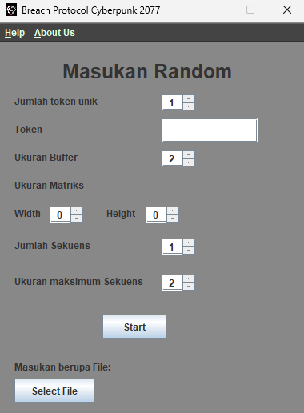

# Tugas Kecil 1 Strategi Algoritma - Suthasoma Mahardhika Munthe 13522098

## Daftar Isi

- [Tugas Kecil 1 Strategi Algoritma](#tugas-kecil-1-strategi-algoritma---suthasoma-mahardhika-munthe-13522098)
  - [Daftar Isi](#daftar-isi)
  - [Cyberpunk 2077 Breach Protocol](#cyberpunk-2077-breach-protocol)
  - [Struktur Program](#struktur-program)
  - [Menjalankan Program dan Requirement](#menjalankan-program-dan-requirement)
  - [Libraries Used](#libraries-used)

## Cyberpunk 2077 Breach Protocol

Cyberpunk 2077 Breach Protocol adalah sebuah *minigame* peretasan pada permainan video Cyberpunk 2077. *Minigame* ini merupakan simulasi peretasan jaringan lokal dari *ICE (Intrusion Countermaeasures Electronics)* pada permainan *Cyberpunk 2077*.

Pada awal permainan akan ada sebuah matriks berisi token-token, buffer berisi token-token dengan jumlah maksimal token, dan sekuens berisi rangkaian token (dua atau lebih) yang memiliki bobot *reward*. Pemain bergerak dengan pola vertikal, horizontal, vertikal, dan seterusnya secara bergantian. Pemain memilih token pertama pada barisan paling atas pada matriks. Kemudian, mengikuti langkah pola permainan memilih token lain dan mencocokkannya dengan sekuens yang tersedia. Buffer yang memiliki jumlah token paling sedikit dengan poin *reward* terbanyak menjadi solusi optimal permainan ini. Sementara itu, jika tidak ada buffer yang memuat sekuen sama sekali maka tidak ada solusi yang ditemukan. 

Proyek ini adalah membuat suatu algoritma dengan pendekatan *brute force* untuk menyelesaikan permainan *Cyberpunk 2077 Breach Protocol*.

## Struktur Program

```
│ .gitignore
│ README.md
├── bin
│   ├── models
│   │   ├── Buffer.class
│   │   ├── Matrix.class
│   │   ├── Sequence.class
│   │   └── Visited.class
│   ├── operations
│   │   └── Game.class
│   └── Main.class
├── doc
├── src
│   ├── models
│   │   ├── Buffer.java
│   │   ├── Matrix.java
│   │   ├── Sequence.class
│   │   └── Visited.class
│   ├── operations
│   │   └── Game.java
│   └── Main.java
└── test
    ├── input                  # Semua masukan berupa file disimpan di folder ini
    └── output                 # Hasil penyimpanan solusi disimpan di folder ini
```

## Menjalankan Program dan Requirement

Untuk menjalankan program dibutuhkan java versi 20+ (*windows*). (Soalnya waktu coba run di *ubuntu* pakai yang versi 19 gabisa, hehe)

Untuk menjalankan program, pada *root directory* pindah ke folder bin dengan command cd bin
```
cd bin
```
Selanjutnya, jalankan program dengan command java Main
```
java Main
```
Program akan berjalan dengan tampilan awal seperti ini
<br>
<p align="center">

</p>

Kemudian, pada pilihan masukan berupa file, file berekstensi ```.txt``` harus disimpan di dalam folder ```test/input```. Input saat diminta  ```Masukkan source file: ``` hanya nama file saja (diikuti ekstensi ```.txt```). Contohnya ```testCase1.txt```.